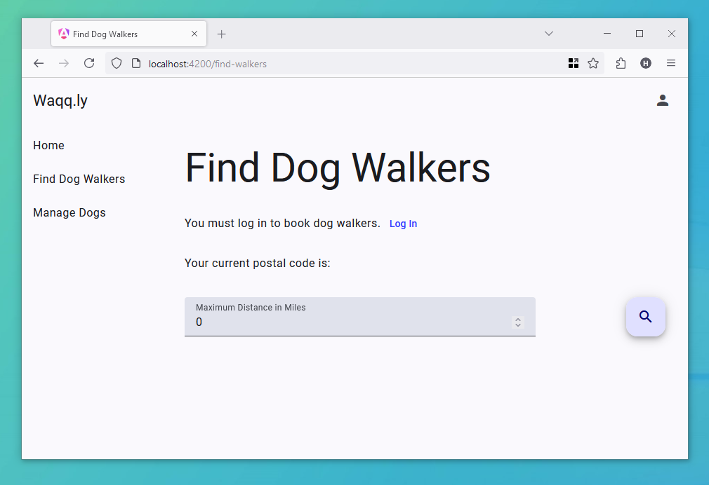
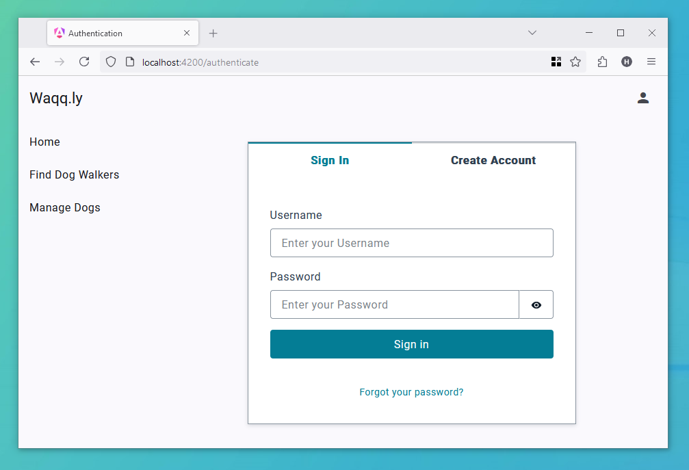

# Dog Walker Finder (Waqqly)


## Overview

The "Dog Walker Finder" application for dog owners to find dog walkers within their local
area (distance specified). The scenario states that the this application will be created
by a small startup focused on using the cloud's scalable services. This is an assignment
from the module BS3928 Cloud Computing and Infrastructure at the University of Winchester.
The hand-in date for this assignment was Friday, the 24th of May 2024. **Further**
**development of this application will not be pursued.**

## Original Requirements

* The application has the ability to create accounts and optionally register as a dog
walker.
* Users should be able to add their dogs to their account.
* The application should allow users to edit their account and dog information.
* Users should be able to search for dog walkers in their local area based on postalcode
and distance provided.
* THe application must make use of the cloud.

## Deployment

```sh
# Setup your AWS Profile Configuration, if you haven't already.
amplify configure
# Initialise project with amplify, specifing your AWS Profile.
amplify init
# Upload the stack to your AWS Account
amplify publish
```

Please note that these deployment steps have not been validated for functionality and may
fail.

## Local Deployment

The application requires amplify to be setup with the functions, storage and
authentication for functionality.

```sh
# Install packages
npm install
# Initialise project with Amplify
amplify init
# Run application. This will open your default web browser on localhost:4200.
ng serve --open
```

## Usage

> [!NOTE]
> Please note that this application was developed with Angular 17.3 with non standalone
> components. It has not been tested with the updated Angular 18 after upgrading.

Upon loading the application, the home page is shown (a blank page with "Waqq.ly" and "a
dog walkers application"). The basic scaffolding of the application contains a header
toolbar with a static application title and an account manager button. The sidebar
navigation automatically adapts to mobile device, add a button to show or hide the panel
in the header.

Below shows the find dog walker page where the postal code is from the account holder and
the user can change the radial distance of the dog walkers search.



The account button shows either the login page or the account page if already logged in.
A logged-in user will be given additional options, such as registering as a dog walker and
adding their dogs to the system.



## Known Issues and Limitations

* Access to the 'Manage Dogs' page requies active user login status. Without active login,
the button will not direct to the page.
* The functionality for searching nearby walkers is dependant on providing a valid
postalcode upon account creation or within an edit profile section. This postalcode
must not have any spaces.
* Users may encouter issues with logging in. Reloading is required after logon to refresh
application state.

## Font Hosting

The application uses the Roboto font from Google Fonts. _This is not compliant with GDPR._
_If this was a production application, an alternative method would have to be used._

## References

* Angular (under MIT): <https://github.com/angular/angular>
* Angular Material (under MIT): <https://github.com/angular/components>
* AWS Amplify Package (under Apache 2.0): <https://github.com/aws-amplify/amplify-js?tab=readme-ov-file>
* AWS Amplify Angular UI (under Apache 2.0): <https://github.com/aws-amplify/amplify-ui>
* AWS Amplify: <https://aws.amazon.com/amplify/>
* Angular: <https://angular.dev/>
* Postcode.io (under MIT): <https://github.com/ideal-postcodes/postcodes.io/>
